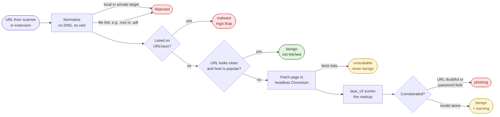
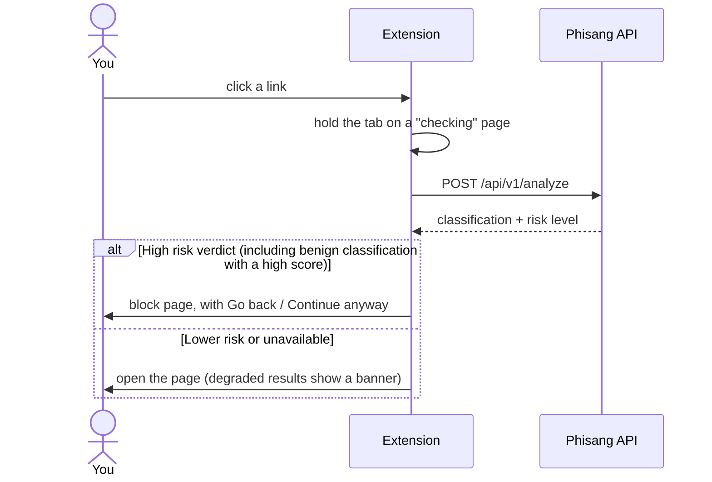

<div align="center">


# Phisang

**Reads the peel before you bite.** A Chrome extension, web scanner and API that catches malware and phishing links before the page opens.


[How it works](#-how-it-works) · [Risk levels](#-risk-levels) · [Quick start](#-quick-start) · [Try it](#-try-it) · [API](#-api) · [Layout](#-project-layout)

</div>

> [!WARNING]
> Phisang is a proof of concept, not production protection. A `benign` result means nothing suspicious was found. It does **not** mean the site is safe.

Registration details, captured page previews and on-demand AI explanations are
documented in [Scan evidence setup](docs/scan-evidence.md), including the SQL
migration and configurable OpenAI-compatible provider settings. The extension's
local cache and false-positive reports are documented in
[Local cache and reports](docs/local-cache-and-reports.md). Failed scans are
logged but automatically retried on the next Peel; they are never reused as a
completed result. Phisang scans webpages only: links to files (executables,
archives, documents, media, data) are refused with `unsupported_content`, as
described under [File URL restrictions](docs/scan-evidence.md#file-url-restrictions).

## 🍌 How it works

Every URL passes through up to four gates. It stops at the first gate that can decide.



<details>
<summary><b>What each gate does, in detail</b></summary>

1. **Normalize** the URL and refuse local or private-network targets. Known file links (the extensions in [`backend/app/file_types.json`](backend/app/file_types.json)) are refused here too, before the scan archive or URLhaus is consulted.
2. **URLhaus lookup** ([abuse.ch](https://urlhaus.abuse.ch/)). An exact URL match (or the same path on that host, or any listing on a malware IP) blocks immediately as `malware`. A few unrelated rows on a large site such as `www.google.com` do **not** block every page on that host.
3. **Lexical heuristic** on the URL string (hand-written rules, not a trained model). If it looks clearly benign (confidence above 80%) **and** the host is on the well-known list or the [Tranco](https://tranco-list.eu) top-domain ranking, the URL is cleared without being visited.
4. **Page analysis** for everything else. The destination is fetched in a locked-down headless Chromium, and its cleaned markup is scored by **laya_v3** (ModernBERT-large, fine-tuned from [`convaiinnovations/laya`](https://huggingface.co/convaiinnovations/laya)).
   - A benign-looking page does not clear a URL that itself looks like phishing. Phishing kits often serve a clean landing page first.
   - The API's `phishing` classification requires a doubtful URL or a password field to corroborate the model. The extension also stops any result the website displays as **High risk**, even if the API classification remains `benign`.
   - A dead host, a non-2xx status or a timeout gives `unavailable`, so a taken-down phishing site is never reported clean.
   - Every redirect hop, the browser navigation and the final response are checked again: a file link, an attachment, or a document that is not HTML/XHTML is refused as `unsupported_content` before model inference.

</details>

### In the browser



## 🚦 Risk levels

Every result carries a `risk_score` from 0 to 1 and a `risk_level`. Each band includes its lower bound.

| | `risk_score` | `risk_level` | Typical cause |
|:-:|---|---|---|
| 🟢 | 0 – below 0.4 | `SAFE` | Popular host with a clean URL, or a page the model finds unremarkable |
| 🟡 | 0.4 – below 0.6 | `POTENTIALLY UNSAFE` | Mixed signals: be careful before entering anything |
| 🟠 | 0.6 – below 0.8 | `MALICIOUS` | The model or the URL shape points to phishing |
| 🔴 | 0.8 – 1.0 | `High Risk` | URLhaus listing, or a strong phishing reading |

<details>
<summary><b>Where the score comes from</b></summary>

| Decided at | `risk_score` |
|---|---|
| URLhaus match | always 1.0 |
| Heuristic (popular host cleared) | heuristic risk (0–100) ÷ 100 |
| Page analysis | laya_v3's phishing score. A page scoring 0.6 or more is labelled `phishing`. |
| URL alone forces a block | raised to at least 0.6 |
| Address is plain HTTP | **+0.1 on top of whichever row above applied**, capped at 1.0 — the score can never exceed 100% |
| `unavailable` | `null` |

> [!NOTE]
> A page can come back `benign` with a `High Risk` level when the model is worried but other checks do not corroborate it. The website still displays **High risk**, and the extension sends it to the warning page. Both use the same rule: malware/phishing classification, a malicious verdict, or a score of at least 0.6. Unavailable checks remain unknown.

</details>

## 🚀 Quick start

**You need:** Python 3.10+ (3.14 works), Node.js, Google Chrome, a free [`URLHAUS_AUTH_KEY`](https://auth.abuse.ch/), and the laya_v3 model folder ([how to get it](#the-page-model)).

**1. Configure**

```bash
cp .env.example .env    # then fill in URLHAUS_AUTH_KEY
```

**2. Backend**

```bash
cd backend
python -m venv .venv
source .venv/bin/activate          # Windows: .venv\Scripts\activate
pip install -r requirements.txt
python -m playwright install chromium
```

**3. Scanner UI**

```bash
cd ../web
npm install
npm run build
```

**4. Run**

```bash
cd ../backend
uvicorn app.main:app --reload --port 8000
# Windows: add --loop asyncio:ProactorEventLoop
```

> [!IMPORTANT]
> On Windows, `--reload` makes uvicorn use an event loop that cannot start Chromium, so page analysis stays off and scans come back **Risk unknown**. Adding `--loop asyncio:ProactorEventLoop` fixes it. `GET /api/v1/health` shows `"page_stage_ready": true` when page analysis is working.

Open **http://localhost:8000**. For UI work, `cd web && npm run dev` runs Vite with `/api` proxied to port 8000.

<details>
<summary><b>🧩 Load the Chrome extension</b></summary>

1. Open `chrome://extensions`
2. Enable **Developer mode**
3. **Load unpacked** → select the `extension/` folder
4. The extension connects to `https://phisang.kennethsunjaya.com`; no local API is required
5. Leave **Protect navigations** on in the toolbar popup while demoing; turn it off when you need to browse normally
6. After UI changes, reload the unpacked extension

The extension intercepts `http(s)` navigations (except the public and local scanners). Its
popup and warning page show the estimated risk, captured preview, registration
details, and saved AI explanation. Explain streams a new answer only when one
has not been saved for that scan; Rescan requests fresh findings. The checking
screen and Rescan show live progress. A benign scan no longer skips later checks
for the entire domain; repeat URLs use the API's scan archive, and failed checks
can retry.

Scan requests, saved results, previews, and explanations all use the public
HTTPS API origin defined in `extension/api.js`. The remote reverse proxy forwards
`/api/v1/*` to the backend on that server's `localhost:8000`; extension users never
connect to that loopback address. Keep response buffering disabled for streaming
scan and explanation routes.

The extension reuses completed results across paths on the exact same hostname
from `chrome.storage.local`, without another scan API call. Subdomains are checked
separately. Cached high-risk results still block navigation; failed scans are
retried. Entries expire after six hours, and Rescan replaces the hostname's result.
**Clear local cache** in the popup empties it; the popup also shows how many
hostnames are held. **Report false positive** on a warning files a report for review and
leaves the verdict where it is. See
[Local cache and reports](docs/local-cache-and-reports.md).

A file link (for example a `.exe`, `.zip` or `.pdf` URL) is neither scanned nor
opened: the checking screen stays paused with an explanation and **Go back**, and
it never inherits a cached hostname verdict.

Known domains now pass through the checking screen too. **Continue anyway**
releases only that exact URL for one visit in that tab; it does not exempt the
hostname or later visits. The extension redirects tabs through `webNavigation`;
this is not a network-level guarantee that no initial request reaches a site.

The extension ships as plain JavaScript with no runtime build step. After editing
the website's shared verdict wording, stream reader, file-type guard, or banana artwork, run
`node extension/scripts/sync-web-assets.mjs` (requires `npm install` in `web/`),
then reload the unpacked extension. Run `node --test extension/tests/*.test.cjs`
for worker checks, or `backend/.venv/Scripts/python backend/tests/ui_extension_smoke.py`
for an isolated unpacked-extension browser check with mocked API traffic.

</details>

<details id="the-page-model">
<summary><b>🧠 The page model (laya_v3)</b></summary>

`ai/markuplm/artifacts/` is gitignored, so a fresh clone has no model. laya_v3 is produced by [`finetune_laya_phishing_kaggle.ipynb`](ai/markuplm/finetune_laya_phishing_kaggle.ipynb) on a Kaggle GPU. Download its output folder and place it at:

```
ai/markuplm/artifacts/laya_v3/
├── model.safetensors      (~1.7 GB)
├── metadata.json
├── rl_agent_config.json
├── encoder/
└── tokenizer/
```

- Swap models by editing `PAGE_MODEL_DIR` in `.env` and restarting the API — nothing else needs changing.
- The model runs on CPU. Allow a few GB of RAM.
- The backend picks the loader from the folder's contents, so an older MarkupLM artifact still works if you point `PAGE_MODEL_DIR` at it.
- Without a model the API still starts, but every URL that reaches page analysis comes back `unavailable`. `GET /api/v1/health` reports `page_stage_ready`.

> [!CAUTION]
> laya_v3 is demo-grade. Its `metadata.json` carries no `test_metrics`, so the API reports `page_model_accuracy` as `null` and no held-out accuracy is claimed here. It also ships `"calibrated": false` with temperature 1.0, so its scores are uncalibrated — the 0.4 / 0.6 / 0.8 risk bands are applied to a raw probability. Treat its score as advisory.

</details>

<details>
<summary><b>📈 Popular-domain list (optional)</b></summary>

```bash
cd backend
python scripts/update_tranco.py --top 10000
```

This downloads the Tranco ranking into `backend/data/tranco_top.txt`. Restart the API afterwards. Without the file, only the built-in well-known list in [`backend/app/reputation.py`](backend/app/reputation.py) skips the page fetch.

When that shortcut skips page inspection, the website identifies the list used
and offers **Continue with page scan**. This starts a new observation with
`inspect_page: true`, bypassing both scan-history reuse and the reputation
shortcut. Threat-database checks and destination safety restrictions still apply.
The page scan gets its own preview and explanation; the skipped scan's explanation
is not carried over. Tranco notices show the size of the downloaded list, not an
assumed rank, and older saved results omit the size when it was not recorded.

</details>

<details>
<summary><b>⚙️ All settings</b></summary>

Set these in `.env` at the repository root. Every one except the URLhaus key is optional.

| Variable | Default | What it does |
|---|---|---|
| `URLHAUS_AUTH_KEY` | *(required)* | URLhaus API key |
| `URLHAUS_TIMEOUT_SECONDS` | `15.0` | URLhaus request timeout (a timed-out request is retried once) |
| `CACHE_TTL_SECONDS` | `900` | How long verdicts are cached |
| `HEURISTIC_BENIGN_THRESHOLD` | `80` | Heuristic confidence needed to skip the page fetch |
| `PAGE_STAGE_ENABLED` | `true` | Turn page analysis off entirely |
| `PAGE_MODEL_DIR` | `ai/markuplm/artifacts/laya_v3` | The model folder. Absolute, `~`, or relative to the repository root. The **only** place the model is chosen: [`smoke_test_laya.ipynb`](ai/markuplm/smoke_test_laya.ipynb) reads the same value, so the notebook measures what the API serves |
| `PAGE_FETCH_CONCURRENCY` | `2` | Pages fetched at once |
| `PAGE_FETCH_TIMEOUT_SECONDS` | `20.0` | Navigation timeout |
| `PAGE_FETCH_BUDGET_SECONDS` | `45.0` | Total time allowed per fetch |
| `PAGE_FETCH_PROXY` | *(none)* | Proxy for page fetches, e.g. `http://127.0.0.1:8080` |

</details>

## 🧪 Try it

Paste these into the **scanner**. Each code block has a copy button.

> [!IMPORTANT]
> Do **not** open the malware sample in a normal tab without the extension. Stopping that navigation is the whole point.

**🟢 Popular site:** cleared at `heuristic` and never fetched. Expect `benign`, `SAFE`.

```text
https://www.google.com/search?q=youtube
```

**🚫 File link:** URLs ending in a file extension are refused before any check runs. Expect HTTP 400 with `unsupported_content` ("Phisang scans webpages, not files"); the extension keeps the tab paused.

```text
http://77.73.133.113/lego/mine.exe
```

**🟠 Typosquat:** the URL rules flag the fake `-com` label as suspicious, so the page is fetched. If laya_v3 scores it 0.6 or more it is blocked as `phishing`; a clean-looking page can still come back `benign`.

```text
https://crocs-com.ru/
```

**⚪ Dead phishing-looking host:** the page can't be fetched. Expect `unavailable`, not benign.

```text
https://secure-login-paypal-verify.account-update.xyz/signin
```

Live results depend on the URLhaus feed and on what the sites serve at the time.

## 🔌 API

```bash
curl -X POST http://localhost:8000/api/v1/analyze \
  -H "Content-Type: application/json" \
  -d '{"url": "https://www.wikipedia.org", "client": "web"}'
```

<details>
<summary><b>Example response</b></summary>

```json
{
  "classification": "benign",
  "confidence": 96,
  "risk_score": 0.03,
  "risk_level": "SAFE",
  "decision_stage": "heuristic",
  "threat_intel": { "matched": false, "source": "URLhaus" },
  "page": { "status": "skipped" },
  "signals": ["..."],
  "policy_version": "poc-flowchart-v2.3"
}
```

</details>

| Endpoint | Purpose |
|---|---|
| `POST /api/v1/analyze` | Classify a URL |
| `GET /api/v1/health` | Readiness of URLhaus, cache, page analysis and scan history (`degraded` when SQL history is enabled but unreachable) |
| `GET /api/v1/meta` | Policy version, page model name and accuracy, thresholds |
| `GET /api/v1/scans` | Recent scans (`?limit=` up to 100) |
| `GET /api/v1/scans/{scan_id}` | One scan by ID |
| `POST /api/v1/scans/{scan_id}/report` | File a false-positive report against that scan |

- **Classifications:** `malware` · `phishing` · `benign` · `unavailable`
- **Decision stages:** `urlhaus` · `heuristic` · `page` · `error`
- **Errors:** `unsupported_content` (HTTP 400) for file links and non-HTML pages; `history_unavailable` (HTTP 503) when SQL history is enabled but the lookup fails. A normal scan stops rather than treating the outage as "never scanned"; Rescan and **Continue with page scan** still run fresh checks. Streaming requests emit the same codes as an `error` event.

## ✅ Tests

```bash
cd backend
python -m pytest tests -q
node --test ../extension/tests/*.test.cjs     # Service-worker and local-cache checks
python tests/ui_file_guard_smoke.py           # Browser check of the file-URL guard (see docs/scan-evidence.md)
```

## 🔒 Privacy and licensing

- Keys live in `.env` only. Never put the URLhaus key in the extension.
- Query strings and credentials are stripped from backend logs.
- Page analysis visits the destination from the server. Set `PAGE_FETCH_PROXY` if the server's IP should not be the one visiting suspect sites.
- URLhaus data is provided by [abuse.ch](https://urlhaus.abuse.ch/). Follow their terms (attribution, non-resale / community use).
- This prototype is load-unpacked only. It is not store-ready.

## 🗂️ Project layout

```
Phisang/
├── backend/
│   ├── app/            FastAPI: normalize, URLhaus, heuristics, page fetch + model, risk levels, policy
│   ├── scripts/        update_tranco.py (popular-domain list)
│   └── tests/          pytest suite
├── web/                Scanner UI (React + Vite, served by the API from web/dist)
├── extension/          Chrome Manifest V3 (checking, blocked, popup, banner)
└── ai/
    ├── markuplm/       Page-model training and smoke-test notebooks; artifacts/ holds the models
    └── url_classifier/ Experimental URL-string classifier (not wired into the API)
```
