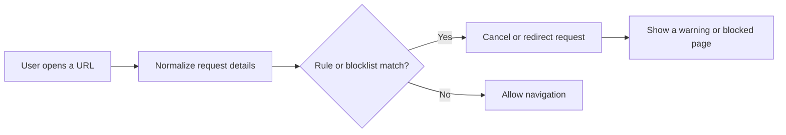
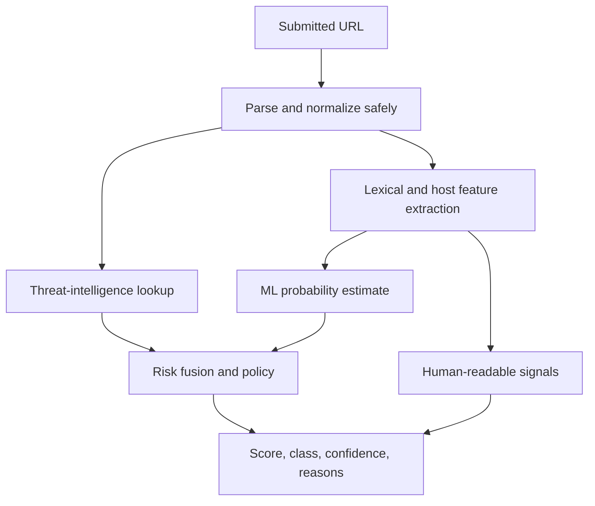
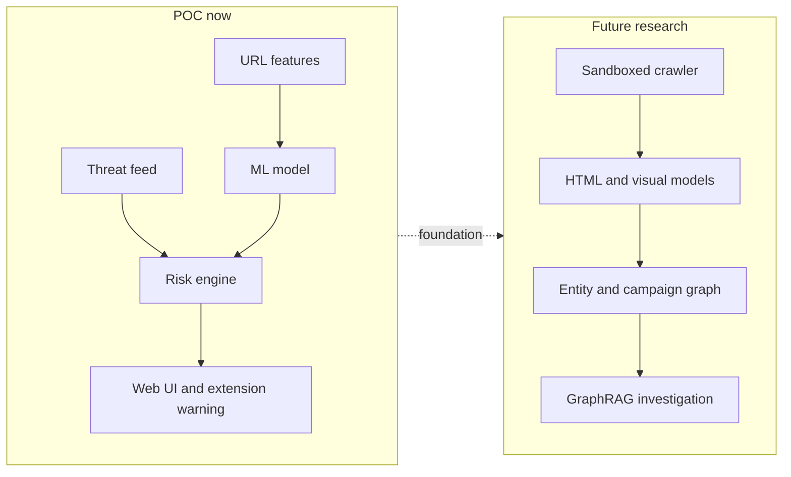
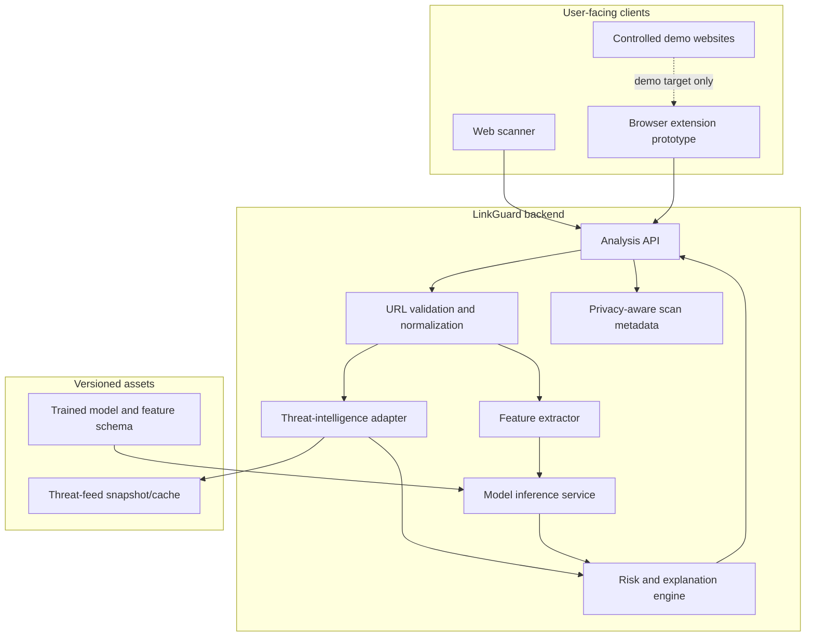
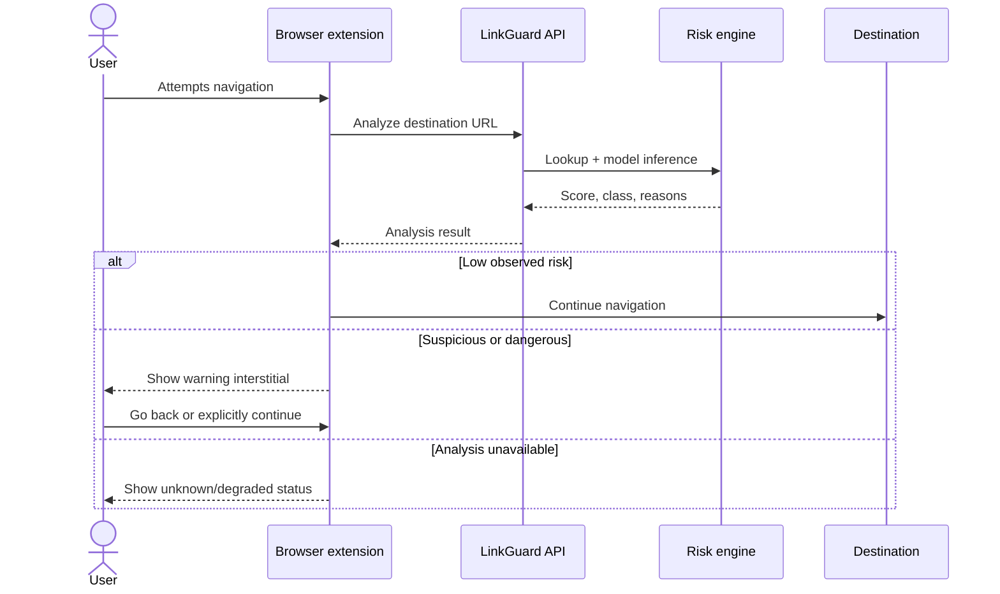
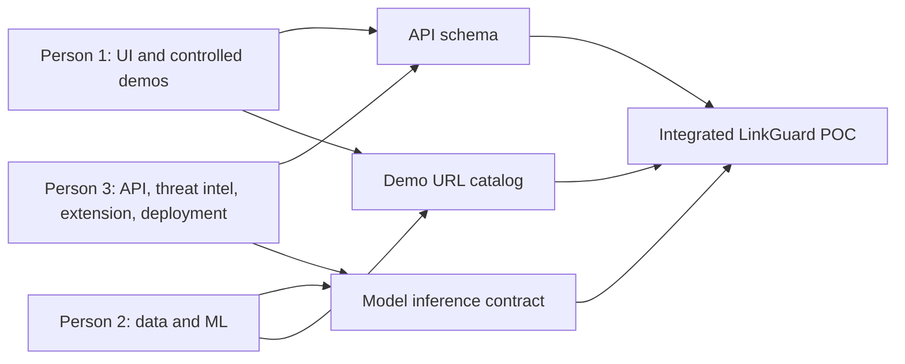
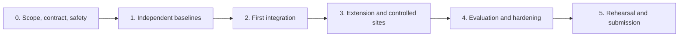
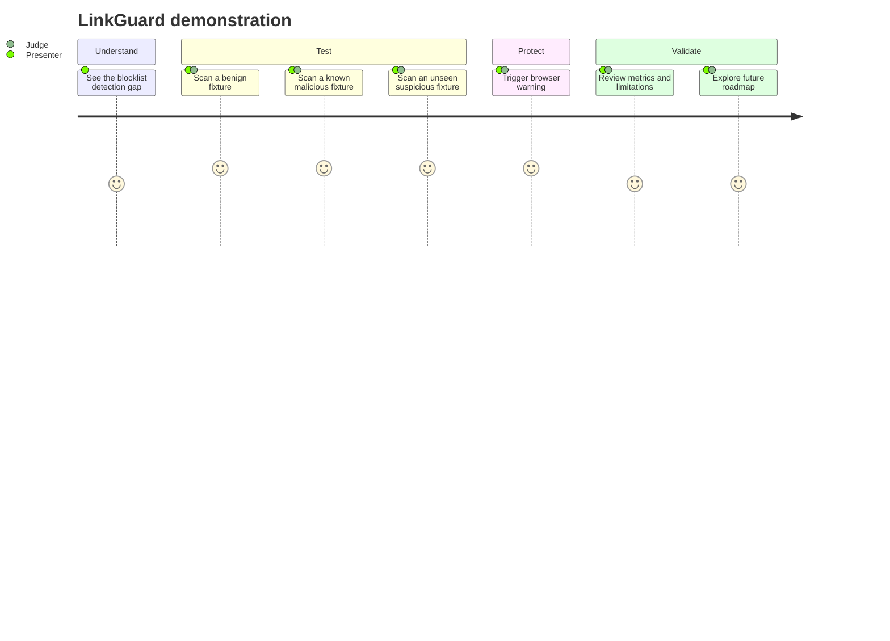
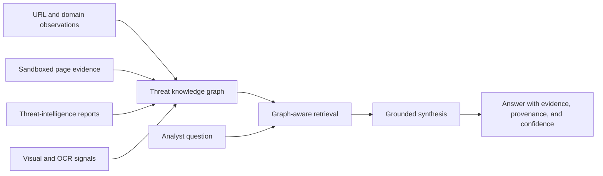

# LinkGuard: AI-Assisted Malicious URL Detection POC

> A consolidated project brief, architecture proposal, and three-person implementation plan for a proof of concept inspired by uBlock-style malicious URL blocking.

## 1. Executive summary

LinkGuard is a proof-of-concept security system that evaluates URLs before or during navigation and explains whether they appear **safe**, **suspicious**, or **dangerous**. It combines two complementary detection methods:

1. **Threat-intelligence lookup** for fast matches against known malicious domains and URLs.
2. **Machine-learning analysis** of URL characteristics to estimate the risk of previously unseen links.

The POC should demonstrate a complete, credible product flow without attempting to build a production-grade web crawler. Its core deliverables are:

- A promotional landing page and URL scanner.
- Controlled safe and suspicious demo websites.
- A URL-feature machine-learning model with documented evaluation.
- A threat-intelligence/blocklist baseline.
- A backend API that combines detection signals into an explainable risk result.
- A lightweight browser-extension concept that can warn before navigation.
- A polished, repeatable end-to-end demonstration.

The principal research claim is not that AI replaces blocklists. It is that **blocklist knowledge and AI generalization work better together**: lists recognize known threats with high confidence, while a model can flag suspicious patterns in URLs that have not yet been reported.

---

## 2. Problem statement

Traditional browser blockers are very effective when a malicious URL, domain, or pattern is already known. Their weakness is the interval between a malicious site appearing and that threat being discovered, verified, published to a list, and downloaded by users.

LinkGuard explores a hybrid approach:

- Preserve the speed and confidence of known-threat matching.
- Add a model that analyzes the URL itself for suspicious structure.
- Provide users with understandable reasons rather than only a binary block.
- Keep the POC technically feasible for a three-person team.

### POC goals

- Classify URLs with a useful and measurable baseline.
- Demonstrate detection of both known and previously unseen suspicious URLs.
- Produce an explainable score and list of contributing signals.
- Integrate detection into a web UI and browser warning flow.
- Compare blocklist-only, model-only, and hybrid behavior.

### Non-goals for the initial POC

- Crawling or rendering arbitrary public websites.
- Executing JavaScript from untrusted pages.
- Downloading files or submitting forms on analyzed sites.
- Claiming production-grade protection or replacing browser security controls.
- Real-time global threat collection.
- A fully hardened or store-published browser extension.

---

## 3. How uBlock-style malicious URL blocking works

Content blockers such as uBlock Origin consume community-maintained filter lists. Although many rules target advertisements and trackers, lists can also identify known malicious domains, URLs, redirectors, or URL patterns.

A simplified navigation decision looks like this:



The blocker typically:

1. Intercepts a browser request through extension APIs.
2. Normalizes or inspects the destination URL and request type.
3. Evaluates filter rules, which may match a hostname, full URL, path, resource type, or pattern.
4. Cancels, redirects, or modifies matching requests.
5. Periodically refreshes its subscribed lists.

This approach is attractive because rule matching is local, fast, transparent, and inexpensive. A confirmed exact match can also carry high confidence.

## 4. Limitations of blocklists

Blocklists remain essential, but a list-only system has structural limitations:

- **Detection delay:** a new campaign may remain unlisted during its most valuable attack window.
- **Coverage gaps:** private, targeted, regional, or short-lived attacks may never reach major feeds.
- **Rapid domain rotation:** attackers can generate domains and paths faster than manual verification pipelines can publish them.
- **URL variation:** small changes to subdomains, paths, query parameters, or encoding may evade overly exact rules.
- **List freshness:** clients must download updates; stale installations have stale protection.
- **False positives and removals:** compromised legitimate infrastructure and ownership changes complicate maintenance.
- **No inherent generalization:** a list knows what it contains; it does not automatically infer that an unseen URL resembles prior attacks.
- **Limited explanation:** a match identifies the rule or list, but may not explain the broader suspicious structure.

The correct POC conclusion is therefore **hybrid detection**, not “AI versus blocklists.”

---

## 5. AI-based improvement

The AI component learns relationships between URL structure and historical labels. It can identify patterns such as impersonation-like hostnames, excessive nesting, encoded text, suspicious tokens, or unusual character distributions even when an exact URL is absent from all lists.



### Why use conventional machine learning first

For a POC, tabular models are faster to train, easier to explain, and easier to benchmark than a Transformer or large language model. Recommended candidates are:

- Logistic Regression as an interpretable baseline.
- Random Forest as a robust nonlinear baseline.
- XGBoost or LightGBM if available and justified by results.

Deep learning should be considered only after a defensible baseline, clean evaluation process, and functioning integration are complete.

---

## 6. Recommended POC scope: no crawler

Removing the crawler is a sound scope decision. Crawling arbitrary pages introduces network safety, sandboxing, content-rendering, anti-bot, latency, and legal/ethical concerns that do not strengthen the first version's core argument.

### Included

- URL submission through a web scanner.
- URL parsing and lexical feature extraction without visiting the destination.
- Domain/URL comparison against a local or provider-backed threat feed.
- Model inference and risk fusion.
- Results UI with clear evidence.
- Controlled demo sites hosted by the team.
- Browser extension prototype or mock integration.
- Evaluation notebook/report and repeatable demo cases.

### Deferred

- Live HTML collection and page rendering.
- DOM, form, screenshot, OCR, and visual-brand analysis.
- Redirect-chain exploration.
- Certificate, DNS-history, WHOIS, and hosting-infrastructure enrichment where it requires live external queries.
- Automated takedown, reporting, or user-submitted threat sharing.



---

## 7. Dataset and model approach

### 7.1 Data sources

Build a balanced and traceable dataset from multiple sources where licensing and redistribution terms permit:

- Public phishing or malicious-URL feeds for positive examples.
- Public benign-domain rankings or curated reputable URLs for negative examples.
- Internally generated controlled examples for demo testing only—not as the main evaluation set.

Every row should retain provenance metadata such as source, collection date, original label, and any deduplication group. Never open malicious URLs during routine preparation; treat them strictly as text.

Suggested schema:

| Field | Purpose |
|---|---|
| `url` | Original observed URL, stored with appropriate access controls |
| `normalized_url` | Deterministic form used for deduplication |
| `label` | Benign or malicious; optionally retain source-specific categories |
| `source` | Dataset/feed provenance |
| `observed_at` | Collection or observation timestamp |
| `registered_domain` | Useful for grouping and leakage prevention |
| `split` | Train, validation, or test |

### 7.2 Cleaning and leakage prevention

Dataset quality matters more than model complexity. The pipeline should:

1. Validate URL syntax without resolving or fetching it.
2. Normalize scheme/host casing, internationalized domains, and default ports consistently.
3. Remove exact duplicates and resolve conflicting labels explicitly.
4. Detect templated near-duplicates when possible.
5. Split by registered domain or campaign group—not only by random rows.
6. Prefer a time-based holdout if timestamps are reliable.
7. Check source artifacts; otherwise, the model may merely learn which feed supplied a sample.

A random row split can place nearly identical URLs from one campaign in both training and test data, producing misleadingly high performance.

### 7.3 Candidate URL features

Features should be computable from the URL string and parsed components alone:

- Total URL, hostname, path, query, and fragment length.
- Number of hostname labels/subdomains.
- Digit, hyphen, dot, slash, special-character, and percent-encoding counts.
- Character entropy or other randomness indicators.
- Presence of an IP literal instead of a domain.
- HTTPS scheme presence—treated only as a weak signal, never proof of safety.
- Suspicious or urgency-related tokens such as `login`, `verify`, `secure`, `update`, or `account`.
- Brand-like token plus unrelated registered domain.
- Punycode or mixed-script indicators.
- Number and shape of query parameters.
- Repeated delimiters, very long labels, or unusual ports.
- Top-level domain representation, handled carefully to avoid unstable stereotypes.

### 7.4 Training and evaluation

Compare at least three configurations:

1. Threat-intelligence lookup only.
2. ML classifier only.
3. Hybrid lookup plus ML policy.

Report:

- Precision, recall, and F1-score for the malicious class.
- False-positive rate, because warning users about legitimate sites is costly.
- Confusion matrix.
- Precision-recall curve and ROC-AUC where appropriate.
- Calibration or reliability plot if the predicted probability becomes part of the user-facing score.
- Inference latency on the intended deployment hardware.
- Results on domain-grouped or time-based holdout data.

Accuracy alone is not sufficient for an imbalanced security dataset.

---

## 8. Threat-intelligence baseline

The baseline can use a periodically refreshed local set of known malicious hostnames and URLs. For reproducibility, pin a snapshot for evaluation and record its date and source.

The lookup layer should distinguish:

- Exact full-URL match.
- Exact hostname or registered-domain match.
- Rule/pattern match, if implemented.
- No match.
- Feed unavailable or stale.

An exact reputable-source match can trigger a high-confidence block. “No match” must mean **unknown**, not safe.

Recommended controls:

- Cache lookups for performance.
- Track feed version and last refresh time.
- Do not send private full URLs, tokens, or query strings to third parties without explicit consent.
- Redact secrets from logs.
- Use timeouts and fail gracefully when a remote source is unavailable.
- Keep provider verdicts separate from the model probability for auditing.

---

## 9. Risk scoring and explainability

The UI needs a stable product score, but that score should be presented as a policy result—not as a scientifically exact probability of harm.

### Suggested fusion policy

Start with an auditable rule-based fusion layer:

| Evidence | Example policy effect |
|---|---|
| High-confidence exact malicious-feed match | Force `dangerous`; score floor 95 |
| Strong ML probability with several coherent signals | Raise into suspicious/dangerous range |
| Moderate ML probability | Warn, but allow the user to return or continue |
| No feed match and low calibrated model probability | Classify as low risk, with an “unknown is not guaranteed safe” note |
| Parser/model/feed failure | Return `unknown`; never silently mark safe |

Example starting thresholds, to be tuned on validation data:

- `0–29`: low observed risk
- `30–69`: suspicious
- `70–100`: dangerous

Example response:

```json
{
  "scan_id": "scan_01J...",
  "normalized_url": "https://secure-login.example.test/verify",
  "risk_score": 87,
  "classification": "dangerous",
  "confidence": "medium",
  "threat_intel": {
    "matched": false,
    "source": null
  },
  "model": {
    "name": "url_xgb_v1",
    "malicious_probability": 0.86
  },
  "signals": [
    "Login and verification terms appear in the path",
    "Hostname contains unusual nesting",
    "URL is significantly longer than the training-set median"
  ],
  "limitations": [
    "The destination page was not visited or analyzed"
  ]
}
```

Explanations should be derived from actual features, rules, or model-attribution output. Avoid fabricated natural-language explanations.

---

## 10. System architecture



### Design principles

- The backend never needs to visit the submitted site in the POC.
- URL normalization is centralized so training and inference behave identically.
- Feature schema and model version are stored together.
- Feed verdicts, model output, and final policy result remain distinguishable.
- Failures produce an `unknown` or degraded result, not a false assurance.

---

## 11. Backend and API design

### Recommended components

- API service: FastAPI, Flask, Express, or another familiar lightweight framework.
- Model artifact: serialized pipeline containing preprocessing and classifier.
- Threat-intelligence adapter: local snapshot first; optional remote provider later.
- Optional database: scan metadata, model version, timestamps, and anonymized outcomes.
- Deployment: one simple service plus static frontend where possible.

### Endpoint outline

#### `POST /api/v1/analyze`

Request:

```json
{
  "url": "https://example.test/login",
  "client": "web"
}
```

Response: the risk result illustrated in the previous section.

Validation rules:

- Accept only supported schemes such as HTTP and HTTPS.
- Reject oversized input.
- Normalize safely before feature extraction.
- Do not resolve, fetch, or follow the URL.
- Remove credentials or sensitive parameters from application logs.

#### `GET /api/v1/scans/{scan_id}`

Optional POC endpoint for retrieving an existing result without rescanning. Only expose records under an appropriate privacy policy.

#### `GET /api/v1/health`

Returns service health, model availability, and feed freshness without exposing secrets.

#### `GET /api/v1/meta`

Returns model version, feature-schema version, decision-policy version, and threat-feed timestamp for reproducible demonstrations.

### Error behavior

Use explicit error categories:

- `invalid_url`
- `unsupported_scheme`
- `input_too_large`
- `model_unavailable`
- `threat_intel_unavailable`
- `analysis_incomplete`

If threat intelligence is unavailable but model inference succeeds, the response may be marked degraded. If core analysis fails, do not produce a reassuring low-risk score.

---

## 12. Frontend and controlled demo environment

### Product pages

| Route | Purpose |
|---|---|
| `/` | Product explanation, value proposition, and primary scan action |
| `/scan` | URL input with examples and privacy notice |
| `/result/:id` | Score, classification, evidence, limitations, and next action |
| `/blocked` | Browser-extension warning/interstitial concept |
| `/methodology` | Model, dataset, limitations, and ethical-use summary |

### Result design

The result page should show:

- Classification and risk score.
- Threat-feed match status.
- Primary signals in plain language.
- A clear statement that the POC did not visit or inspect the page.
- Model/feed version for reproducibility.
- Safe actions: go back, copy result, or continue only in a controlled demo.

Do not rely on red/green alone; pair color with labels and icons for accessibility.

### Controlled demo sites

Create a small set of harmless pages under domains the team controls:

- A normal-looking benign example.
- A visibly suspicious training/demo page.
- A mock credential-themed page that does **not** collect, transmit, or retain information.

The suspicious site exists only to exercise the product flow. It should use conspicuous banners such as “SECURITY DEMO — DO NOT ENTER REAL INFORMATION,” contain no real brand assets unless permitted, and use fake fields with submission disabled.

---

## 13. Browser extension concept

The extension demonstrates how LinkGuard could protect navigation outside the scanner page.

### Minimal POC behavior

1. User clicks or enters a URL.
2. The extension extracts the destination URL.
3. It submits the URL to the LinkGuard API.
4. Low-risk results continue normally.
5. Suspicious or dangerous results redirect to a local warning page.
6. The warning explains why and offers **Go back** as the primary action.



### Practical limitations

- Extension APIs and navigation interception vary across browsers.
- A remote API introduces latency and privacy questions.
- The POC can restrict automatic checks to the team's controlled domains.
- Production use would require authentication, abuse prevention, secure updates, minimal permissions, and browser-store review.

---

## 14. Detailed three-person task distribution

Work should be divided into independently testable streams with explicit integration contracts.

### Person 1 — Product UI and demo environment

**Mission:** make the system understandable, credible, accessible, and easy to demonstrate.

Responsibilities:

- Define the visual identity and user journey.
- Build landing, scanner, result, warning, and methodology pages.
- Implement loading, error, low-risk, suspicious, dangerous, and unknown states.
- Build controlled benign and suspicious demo pages.
- Present explanations, caveats, and model/feed metadata.
- Prepare the scripted demo and presentation assets.
- Coordinate the request/response contract with Person 3.

Deliverables:

- Responsive frontend.
- Safe controlled demo sites.
- Result components using mocked and then live API responses.
- Demo script and test URL catalog.

Acceptance criteria:

- All risk states are readable without relying only on color.
- No demo page captures credentials or personal data.
- A judge can complete the main flow without instructions.
- The UI handles timeouts and incomplete analysis honestly.

### Person 2 — Dataset and AI detection engine

**Mission:** produce the measurable technical detection contribution.

Responsibilities:

- Source, document, clean, label, and deduplicate datasets.
- Prevent registered-domain/campaign leakage across splits.
- Implement the shared URL parser and feature extractor.
- Train Logistic Regression and at least one nonlinear baseline.
- Tune thresholds with attention to false positives.
- Evaluate blocklist-only, model-only, and hybrid configurations with Person 3.
- Package the selected model, feature schema, and version metadata.
- Generate feature-driven reasons suitable for the UI.

Deliverables:

- Dataset card and source manifest.
- Reproducible training pipeline.
- Evaluation report, plots, confusion matrix, and error analysis.
- Versioned model artifact and inference interface.
- Model card documenting intended use and limitations.

Acceptance criteria:

- Metrics are reported on leakage-resistant holdout data.
- Training and backend inference use identical preprocessing.
- The model returns a score plus evidence inputs.
- A fixed seed/environment can reproduce the selected result within reasonable tolerance.

### Person 3 — Backend, threat intelligence, browser integration, and deployment

**Mission:** turn the individual components into a reliable end-to-end system.

Responsibilities:

- Define and implement the API contract.
- Validate and normalize input without fetching destinations.
- Implement the local blocklist/threat-feed adapter.
- Integrate Person 2's model and feature pipeline.
- Implement risk fusion, explanations, failure states, and metadata endpoints.
- Build the browser-extension prototype or interstitial integration.
- Add privacy-aware logging, basic rate limiting, tests, and deployment.
- Own integration checkpoints and release packaging.

Deliverables:

- Running API and API reference.
- Versioned threat-feed snapshot or cache.
- Risk-scoring/policy module.
- Browser-extension prototype.
- Deployed demo environment and integration-test suite.

Acceptance criteria:

- API returns the agreed schema for every valid state.
- No submitted destination is fetched by the POC backend.
- Feed/model failures are visible and cannot become false “safe” results.
- The complete demo can be deployed and repeated from documented steps.

### Shared ownership

| Shared activity | Primary | Reviewers |
|---|---|---|
| API schema | Person 3 | Persons 1 and 2 |
| Risk thresholds | Person 2 | Persons 1 and 3 |
| Explainability wording | Person 1 | Persons 2 and 3 |
| Demo safety review | Person 1 | Entire team |
| End-to-end tests | Person 3 | Entire team |
| Evaluation narrative | Person 2 | Entire team |
| Final demo rehearsal | Entire team | Entire team |



---

## 15. Development stages

The stages can map to short sprints or project weeks depending on the deadline.

### Stage 0 — Contract and safety alignment

- Freeze POC goals and non-goals.
- Agree on URL/result schemas and classification labels.
- Select data sources and document licenses/terms.
- Register controlled demo domains or use reserved/local test hostnames.
- Define success metrics and demo scenarios.

**Exit condition:** mock API response renders correctly in the result UI; all members agree on the contract.

### Stage 1 — Independent baselines

- Person 1 builds the complete UI using fixtures.
- Person 2 builds the cleaning, splitting, feature, and baseline training pipeline.
- Person 3 builds input validation, a mock endpoint, and threat-list lookup.

**Exit condition:** each workstream has a runnable demonstration and automated smoke checks.

### Stage 2 — First integration

- Connect the trained pipeline to the API.
- Connect the frontend to live results.
- Implement initial risk thresholds and explanations.
- Test known benign, known malicious, and unknown synthetic cases.

**Exit condition:** the scanner works end to end without visiting submitted URLs.

### Stage 3 — Extension and controlled sites

- Build controlled demo pages.
- Add the extension/interstitial flow.
- Restrict extension testing to controlled destinations.
- Validate that warning and failure states are clear.

**Exit condition:** one controlled navigation produces a repeatable warning demonstration.

### Stage 4 — Evaluation and hardening

- Freeze the test set and feed snapshot.
- Compare lookup-only, model-only, and hybrid results.
- Inspect false positives and false negatives.
- Add rate limits, redaction, timeouts, and degraded-service handling.
- Test clean deployment from documentation.

**Exit condition:** metrics, limitations, versions, and repeatable setup are documented.

### Stage 5 — Demo rehearsal and submission

- Run the complete presentation under realistic timing.
- Record a fallback video or screenshots.
- Prepare an offline/local fallback for network failures.
- Freeze model, feed, policy, and app versions.
- Assign speaking and recovery roles.

**Exit condition:** the team can repeat the demo reliably and explain both strengths and limitations.



---

## 16. Controlled suspicious website safety notes

The demo must not create a real phishing capability.

- Use only domains and infrastructure the team owns or an isolated local environment.
- Never clone a real organization's page in a way that could deceive the public.
- Do not use real logos, trademarks, support details, or authentication endpoints without permission.
- Place an obvious security-demo banner on every page.
- Disable form submission; use inert buttons or local-only dummy behavior.
- Never collect usernames, passwords, cookies, payment details, or personal information.
- Do not send emails, messages, or links that could be mistaken for a real attack.
- Prevent search indexing with appropriate headers/meta directives, while recognizing that these are not access controls.
- Restrict access where practical and remove the public demo after evaluation.
- Do not include malware, exploit code, drive-by downloads, aggressive redirects, or deceptive browser prompts.
- Record authorization and scope for team testing.

For ML feature demonstrations, suspicious-looking strings can be placed in harmless `.test`, localhost, or owned-domain URLs. The objective is to validate detection and communication—not to reproduce harm.

---

## 17. Recommended demo flow

Target a concise, predictable sequence:

1. **Introduce the gap:** list-based blockers recognize known threats but cannot inherently generalize to every unseen link.
2. **Show a benign URL:** the threat feed does not match, the model score is low, and the result explains the limited evidence.
3. **Show a known malicious fixture:** the pinned threat-feed snapshot matches it and the system returns a high-confidence dangerous verdict.
4. **Show an unseen controlled suspicious URL:** no list match exists, but the model identifies multiple suspicious lexical signals.
5. **Show browser protection:** navigate toward the controlled suspicious site and display the interstitial.
6. **Show evidence:** briefly display the comparison metrics and confusion matrix.
7. **State limitations:** the POC does not crawl the site, and a low score is not a guarantee of safety.
8. **Close with the roadmap:** page content, visual analysis, campaign graphs, and GraphRAG.



### Demo reliability checklist

- Use a pinned model and threat-feed snapshot.
- Preload the service and verify health.
- Keep the controlled fixtures unchanged after final evaluation.
- Have screenshots/video and an offline response fixture ready.
- Avoid depending on a real malicious domain being online.
- Display version identifiers so results are reproducible.

---

## 18. Future extensions

### 18.1 Sandboxed crawler and content analysis

A later system could visit destinations inside a hardened, disposable environment to extract:

- Redirect chains and final destinations.
- DOM structure, forms, scripts, links, and iframe relationships.
- Text cues, credential requests, urgency language, and obfuscation.
- Screenshots for visual similarity analysis.
- Network requests and downloaded-resource metadata.

This requires strict egress rules, resource limits, isolation, ephemeral storage, safe artifact handling, SSRF defenses, and no access to internal networks or user credentials.

### 18.2 Multimodal detection

Combine evidence from:

- URL lexical model.
- HTML/DOM model.
- Screenshot or visual-brand similarity model.
- OCR and text classifier.
- Redirect/network behavior.
- Reputation and infrastructure history.

The fusion layer should retain provenance so analysts can see which modality contributed each signal.

### 18.3 Campaign graph

Represent entities and relationships such as:

- URL → hostname → registered domain.
- Domain → IP address → autonomous system/provider.
- Page → linked resource → redirect destination.
- Certificate → domains.
- Observed brand or kit → related pages.
- Threat report → indicator → campaign.

Graph analysis can reveal clusters and infrastructure reuse that single-URL classification misses.

### 18.4 GraphRAG investigation assistant

GraphRAG could ground analyst questions in a campaign graph and associated evidence. Example questions include:

- “Which newly observed domains share infrastructure with this confirmed campaign?”
- “What evidence connects this URL to a known phishing kit?”
- “Which indicators have the strongest provenance and recency?”

The language model should summarize retrieved evidence, not independently declare a URL malicious. Every claim should link back to observations, feed records, or model outputs, with timestamps and confidence.



### Other possible extensions

- Active learning from reviewed false positives and false negatives.
- Privacy-preserving local inference in the browser.
- Organization-specific allowlists and policies.
- Drift monitoring and scheduled recalibration.
- Analyst feedback and case-management workflows.
- Domain-age and certificate/DNS enrichment.
- Adversarial robustness testing against URL obfuscation.

---

## 19. Key risks and mitigations

| Risk | Mitigation |
|---|---|
| Dataset leakage inflates metrics | Group by registered domain/campaign; add time-based holdout |
| False positives erode trust | Tune for precision, show reasons, allow safe override in controlled contexts |
| “No list match” is interpreted as safe | Label it unknown and continue model analysis |
| Model score is mistaken for certainty | Use calibrated outputs, confidence labels, and explicit limitations |
| Sensitive URLs appear in logs | Redact credentials/query secrets; minimize retention |
| Remote feed/API failure | Cache data, expose degraded status, never default to safe |
| Demo site creates real phishing risk | Owned infrastructure, disabled forms, visible banners, no brand impersonation |
| Team integration slips | Freeze contracts early; use fixtures and staged integration checkpoints |
| Public malicious URLs expose presenters | Use inert, controlled fixtures and pinned feed records |

---

## 20. Definition of done

The POC is ready when:

- [ ] The web scanner accepts and validates HTTP/HTTPS URLs.
- [ ] Submitted destinations are never fetched by the POC.
- [ ] Threat-intelligence and ML outputs are returned separately.
- [ ] The final result includes classification, score, confidence, reasons, limitations, and versions.
- [ ] The model has a reproducible training pipeline and leakage-resistant evaluation.
- [ ] Lookup-only, model-only, and hybrid results are compared.
- [ ] The frontend covers low-risk, suspicious, dangerous, unknown, loading, and error states.
- [ ] Controlled demo sites cannot collect or transmit sensitive information.
- [ ] The browser-extension concept shows a warning on a controlled destination.
- [ ] Privacy, failure behavior, and POC limitations are documented.
- [ ] A clean deployment and rehearsed demo can be repeated by the team.

## 21. Final recommendation

Build the first LinkGuard version as a **hybrid URL-level detector with excellent evaluation and presentation**. Keep page crawling out of scope. A modest, reproducible model plus a trusted-feed baseline, clear risk policy, safe controlled demonstration, and well-integrated extension concept will make a stronger POC than a broader system whose components cannot be validated.

The three-person split gives each member clear ownership:

- Person 1 owns the product experience and safe demo environment.
- Person 2 owns data quality, modeling, and evaluation.
- Person 3 owns the backend, threat intelligence, browser integration, and deployment.

Together, these workstreams demonstrate the central idea: known-threat intelligence provides certainty where evidence exists, while machine learning helps identify suspicious structure beyond the current list.
